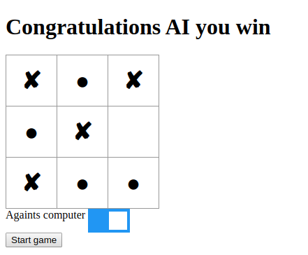

# Tic Tac Toe

> Let's play [Tic Tac Toe](https://www.wikihow.com/Play-Tic-Tac-Toe). With this game you can play against the computer or another human player.

    

The porpuse of this project was to put into practice [Factory Functions](https://www.theodinproject.com/courses/javascript/lessons/factory-functions-and-the-module-pattern#factory-function-introduction) and [The Module Pattern](https://www.theodinproject.com/courses/javascript/lessons/factory-functions-and-the-module-pattern#the-module-pattern) along with the main concepts of Object Oriented Programming. Particularly, classes/objects and how to access their methods and attributes. We also implement [minimax](https://www.geeksforgeeks.org/minimax-algorithm-in-game-theory-set-3-tic-tac-toe-ai-finding-optimal-move/) algorithm to play against the computer.

## Built With

- CSS
- HTML
- JavaScript

## Live Demo

[https://JuanPabloGil.github.io/Tic-Tac-Toe-JS/](https://JuanPabloGil.github.io/Tic-Tac-Toe-JS/)

## Getting Started

To get a local copy up and running follow these simple example steps.

### Prerequisites

Download the project

    $ git clone https://github.com/JuanPabloGil/Tic-Tac-Toe-JS.git

Install the dependencies

    $ npm install

### Usage

- Open **index.html** file with your favorite browser. It's inside the project's root directory.
- That's it. Let's start playing Tic Tac Toe.

### Run tests

Execute the next command

    $ npm run test

## Authors

👤 **Ivan Ulises Guzman Sanchez**

- Github: [@fivan18](https://github.com/fivan18)
- Twitter: [@fivanunam](https://twitter.com/fivanunam)
- Linkedin: [fivan](https://www.linkedin.com/in/fivan)

👤 **Juan Pablo Gil**

- [GitHub](https://github.com/JuanPabloGil ) 
- [@LinkedIn](https://www.linkedin.com/in/juan-pablo-gil-1321a515a/) 
- jpablomgil@gmail.com

## 🤝 Contributing

Contributions, issues and feature requests are welcome!

Feel free to check the [issues page](https://github.com/JuanPabloGil/Tic-Tac-Toe-JS/issues).

## Show your support

Give a ⭐️ if you like this project!

## Acknowledgments

- Thanks to [Sebastian Lague](https://www.youtube.com/channel/UCmtyQOKKmrMVaKuRXz02jbQ) for [this](https://www.youtube.com/watch?v=l-hh51ncgDI) good explanation about minimax algorithm.

## 📝 License

This project is [MIT]() licensed.
